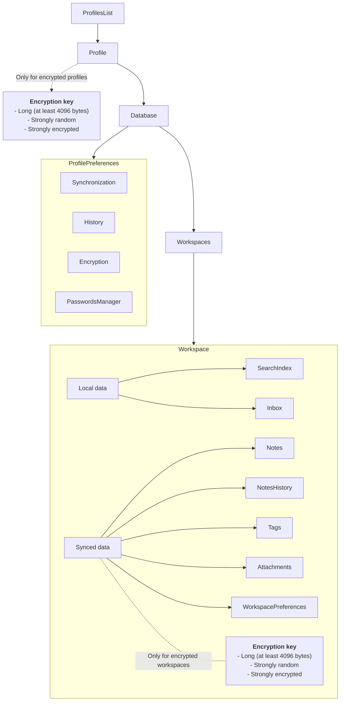

```mermaid
flowchart TD
ProfilesList-->
Profile-.Only for encrypted profiles.->DBKey["`
    **Encryption key**
    - Long (at least 4096 bytes)
    - Strongly random
    - Strongly encrypted
`"]
Profile-->DB["Database"]
DB-->ProfilePreferences
DB-->Workspaces-->Workspace

subgraph ProfilePreferences
    Synchronization
    History
    Encryption
    PasswordsManager
end

subgraph Workspace
    Local["Local data"]
        Local-->SearchIndex
        Local-->Inbox
    Sync["Synced data"]
        Sync-->Notes
        Sync-->NotesHistory
        Sync-->Tags
        Sync-->Attachments
        Sync-->WorkspacePreferences
        Sync-.Only for encrypted workspaces.-WorkspaceKey["`
            **Encryption key**
            - Long (at least 4096 bytes)
            - Strongly random
            - Strongly encrypted
        `"]
end
```