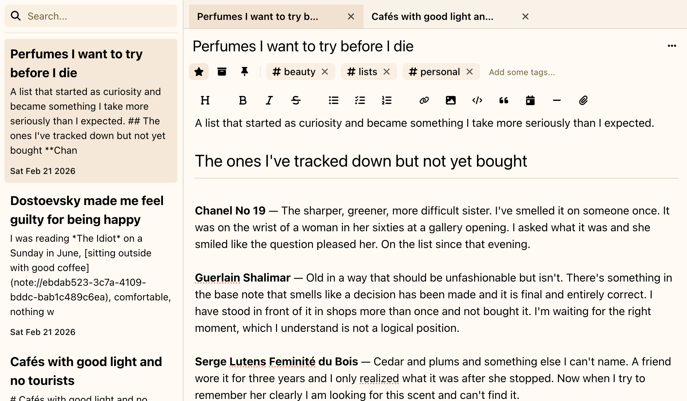
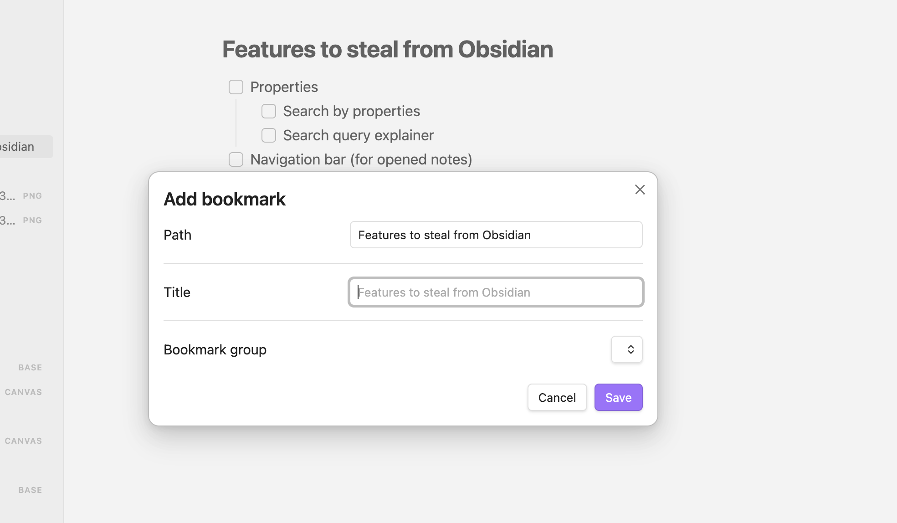

Most note-taking apps don’t waste your time in obvious ways.

They waste it in *micro-frictions*: tiny, repeatable speed bumps that steal seconds, break focus, and quietly tax your attention all day.

Modern knowledge work [already involves](https://hbr.org/2022/08/how-much-time-and-energy-do-we-waste-toggling-between-applications) constant "toggling" between apps and sites, often thousands of switches a day, so every extra step matters.

Deepink is built around one idea: **make the common actions feel instant** - because that’s where the real time goes.

## The hidden tax of the extra clicks

Bookmarking a note should be a single motion. But in many apps it looks like this:

1. Open a menu (often a hamburger/overflow menu)
2. Find the action
3. Confirm or name it
4. Choose a folder/group
5. Close the dialog and get back to what you were doing

That’s not just time. It’s *reorientation*: you leave your thought, operate the UI, then try to resume the original task.

And when actions are tucked behind hidden navigation, the cost increases. Nielsen Norman Group has shown that "hamburger"/hidden menus [hurt UX metrics](https://www.nngroup.com/articles/hamburger-menus/) like discoverability and task performance compared to visible options.

## Why This Adds Up (Even If Each Moment Feels Small)

Human-computer interaction research has a blunt message: task time is built from tiny pieces.

The [Keystroke-Level Model (KLM)](https://cacm.acm.org/research/the-keystroke-level-model-for-user-performance-time-with-interactive-systems/) predicts task completion time by summing the small operators involved - pointing, clicking, typing, and mental preparation. If a workflow adds steps, it adds time - reliably.

Even worse, frequent UI detours create a focus cost. [Research](https://www.sciencedirect.com/science/article/abs/pii/S0749597809000399 "Organizational Behavior and Human Decision Processes - Leroy, 2009") on **attention residue** shows that after switching tasks, part of your attention remains stuck on the previous task, reducing performance on the next one. That’s why "just a quick menu action" can feel mentally sticky.

## The Compounding Effect: Seconds → Hours → Weeks

Assume a micro-friction costs $3$–$5$ seconds (a couple extra clicks plus reorientation). Here’s what that looks like at different usage levels:

| Micro-actions/day | Extra time per action | Time lost/day | Time lost/month ($20$ workdays) | Time lost/year ($250$ workdays) |
|---:|---:|---:|---:|---:|
| 100 | $3$–$5$s | $5$–$8.3$ min | $1.7$–$2.8$ hrs | $21$–$35$ hrs |
| 300 | $3$–$5$s | $15$–$25$ min | $5$–$8.3$ hrs | $62$–$104$ hrs |
| 600 | $3$–$5$s | $30$–$50$ min | $10$–$16.7$ hrs | $125$–$208$ hrs |

A note-taking app isn’t just "writing notes." It’s the constant stream of micro-actions around thinking: capture, file, link, tag, search, reuse, share. If note work is part of the daily routine, **hundreds of micro-actions per day is normal** - which is exactly why micro-friction becomes a real-life time leak.

## Where Note Apps Commonly Bleed Time

These are the everyday moments that quietly slow people down:

- **Capture friction**
  - switching context to open the app
  - choosing a notebook/folder every time
  - slow "new note" flows that require setup before writing
- **Filing friction**
  - too many required fields (folder, tags, project, status)
  - repetitive dialogs for actions that should be one gesture
- **Linking friction**
  - multi-step "insert link" flows that force searching, confirming, then re-finding your place
- **Tagging friction**
  - tags hidden behind menus, poor autocomplete, too many clicks to add/remove
- **Retrieval friction**
  - search that’s slow, filters buried, results without useful preview context
- **Reuse friction**
  - copying snippets, formatting, and re-structuring information repeatedly because the tool doesn’t make reuse effortless

None of this looks dramatic in a single moment. But it takes your time day by day.

## The scale of a problem

A bit off topic but it's nice to imagine *the scale of a problem*.

There are a browser extension [Sponsor Block](https://sponsor.ajay.app/), it blocks a "native ads" on YouTube. One user reports the advertisement time ranges on video via UI, and all other users automatically skip that segments. *The typical ad segment size is from 30 seconds to 3-5 minutes*.

Here is my stats reported by the Sponsor Block:

> You've saved people from **13,183** segments
> ( **16d 16h 59.4 minutes** of their lives )
>
> You've skipped **4005** segments ( **3d 1h 6.4 minutes** )

They have a public [Leaderboard with stats](https://leaderboard.sbstats.uk/) if you are interesting.

As you can see, **I've saved a days of my live**. Now imagine how many other things in your live silently waste your time and you don't know about that just because you have no time tracker for all of them.

## What Deepink Does Differently: One-Step Defaults

Deepink is designed to remove micro-friction at the source:

- **Common actions are one-step by default**  
  Not hidden behind a chain of menus and dialogs. This aligns with how task time is actually formed: it’s the sum of small operators ([KLM](https://cacm.acm.org/research/the-keystroke-level-model-for-user-performance-time-with-interactive-systems/)).

- **Less hidden navigation for high-frequency actions**  
  When the UI keeps important actions visible, performance and discoverability improve - exactly the problem hidden menus create ([NN/g](https://www.nngroup.com/articles/hamburger-menus/)).

- **Fewer "breaks in thought" across the day**  
  In a world where app/site switching is constant ([HBR](https://hbr.org/2022/08/how-much-time-and-energy-do-we-waste-toggling-between-applications)), reducing extra steps isn’t cosmetic. It protects focus - especially given what we know about attention residue during switching ([Leroy, 2009](https://www.sciencedirect.com/science/article/abs/pii/S0749597809000399)).

## The Result: More Thinking, Less Tooling

Deepink delivers productivity through *less friction*.

Because the biggest time savings aren’t found in the rare, complex workflows. They’re found in the actions repeated all day - where seconds compound into hours, and hours compound into weeks.

Deepink is built for a notes workflow that moves at the speed of thought.

[Try it](/download) for a week - then compare how much time you spend creating versus navigating.