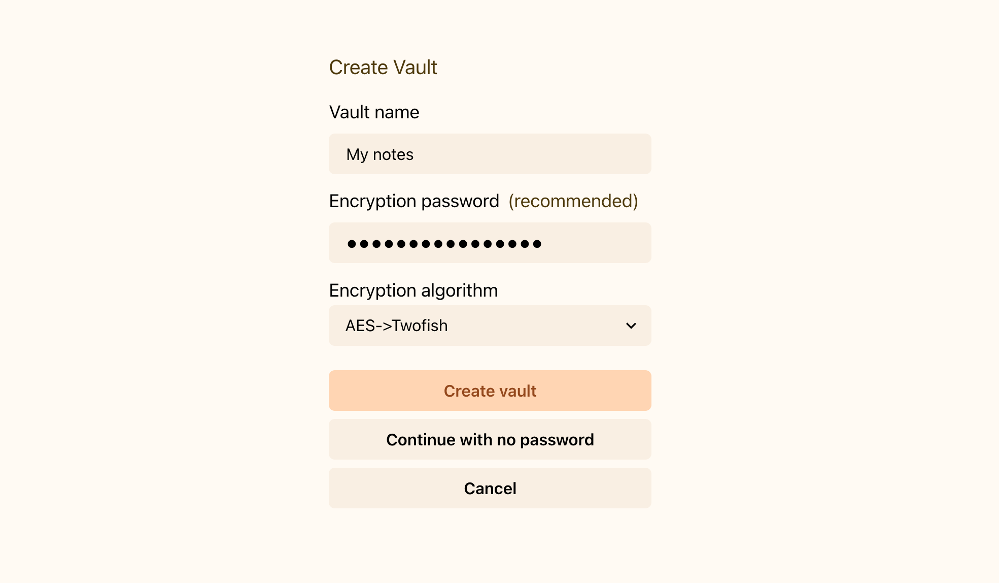

This is a quick introduction to the Deepink workflow.

If you’ve never tried it, [download Deepink](/download) and use it for a few weeks to boost your productivity.

# Create a vault

A vault is a database that contains all your content, including workspaces, notes, attachments, etc.

First, set up your new vault.

Even though you can create a vault with no password, it is [strongly recommended](/introduction/security/#why-do-i-need-to-encrypt-my-data) to set a strong password to encrypt and protect your data.

You need to remember only one password for all your content in the vault.

:::note
Keep in mind that if you forget your password, it cannot be recovered. Nobody can, not even us.
:::

# Add your first note

You can create a new note by clicking the button or using the hotkey `Ctrl+N` or `Cmd+N`.

# Organize your notes

With Deepink, you have flexibility in how you organize your notes.

## Tags

Tags are a powerful way to label your notes.

You can use nested tags like `ideas/art` or `projects/fitness club`. It looks like folders, but unlike folders, you can assign multiple tags to a note. This feature lets you express relationships between notes.

## Stashes

You can add a note to "Bookmarks" and find it quickly later in the corresponding tab.

You can also move a note to "Archive". Unlike Bookmarks, archived notes will be available only in the "Archive" tab. This is useful to stash notes you no longer actively use, but don’t want to delete.

You can also move notes to the "Bin". Notes in the Bin are in read-only mode and will be automatically deleted permanently after some time, according to your retention policy.

## Workspaces

Sometimes you may want a dedicated space to separate concerns.

With Deepink, you can create a new workspace inside your vault.

Every workspace has its own structure—notes, tags, files, etc.

For example, you may have one workspace for personal notes, one for job notes, and another for drafts or research.

You can create as many workspaces as you need, and you’ll still have to remember only one password.